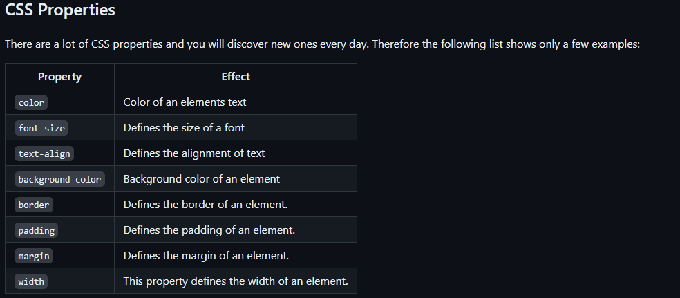
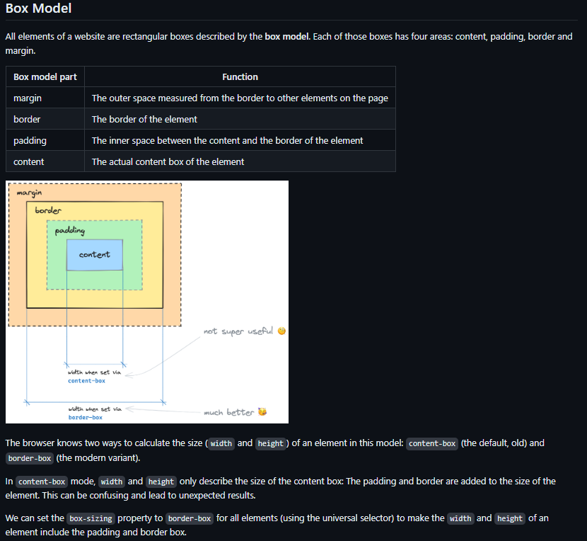

# CSS Basics

-In this chapter we will learn about css basics

## Hints

- _select the hole page in css file, for example _ { box-sizing: border-box;}
- do not use selector margin if you don´t really have to do.

### CSS Properties

### Box Model

